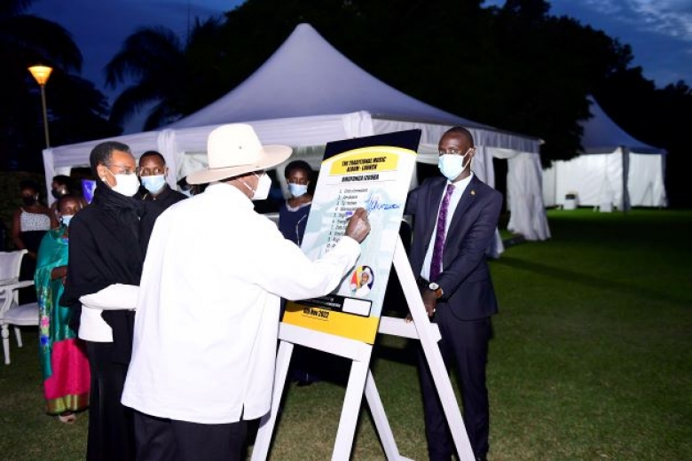

 
# Understanding *Okubona* and the Linguistic Tapestry of Runyankore-Rukiga and Related Bantu Dialects

This repository explores the rich linguistic and cultural meanings tied to the verb **okubona**, as well as its cognates and nuanced uses across several Bantu dialects in Uganda and southern Africa. It draws heavily from the authoritative **Runyankore-Rukiga Dictionary** project and incorporates cultural insights from a traditional music album launch endorsed by Ugandan President Yoweri Museveni.

---

## The Core Meaning of *Okubona*

According to the **Runyankore-Rukiga Dictionary** ([source PDF](https://www.yaaka.cc/wp-content/uploads/2023/03/Runyankore-Rukiga-Dictionary.pdf)), *okubona* is primarily defined as:

- **to find something that has got lost or misplaced.**

Further nuanced verbs derived from *okubona* include:

- **okubonabona**: to suffer; to feel pain, discomfort, sorrow, etc.
- **okubonabonesa**: to treat someone cruelly or harshly.

These subtle variations emphasize not only physical perception but emotional and relational experiences, highlighting the verb's depth within Runyankore-Rukiga.

---

## Cross-Dialectal Insights: *Kubona* and Related Verbs

From a cultural speech by President Yoweri Museveni during the launch of a traditional music album ([link](https://www.yowerikmuseveni.com/president-launches-traditional-music-album)):

- The verb *kubona* means **to see** or **to find** across many Bantu languages.
- In **Zulu** and **Xhosa**, greetings such as “Sauboona” stem from the verb *kubona*, literally meaning *to see*.
- In Ugandan dialects like **Luganda** and **Runyankore**, the verb *kubona* specifically evolved to mean *to find something lost*, while newer terms such as *kulaba* (Luganda) and *kureeba* (Runyankore) are used for *to see*.
- The **Ibo** language in Nigeria has a word meaning **love** that resonates with the emotional core of *okubona* in Runyoro-Rutooro, tying the concept of "finding" or "seeing" to an affectionate or relational sense.

This mutual intelligibility and semantic sharing underscore a linguistic and cultural continuum across Africa's Bantu-speaking peoples.

---

## Cultural Context and Acknowledgements

The **Runyankore-Rukiga Dictionary** project was implemented by the Institute of Languages, Makerere University and UNESCO Nairobi Office, with generous financial and logistical support from UNESCO/Japanese Funds in Trust.

- **Authors:** Yoweri Museveni, Manuel J.K. Muranga, Alice Muhoozi, Aaron Mushengyezi, Gilbert Gumoshabe
- **Editors:** Yusuf Mpairwe, Gordon Kahangi
- **Illustrations:** Peter Kasamba
- **Cover Design:** Robert Kibuuka
- **Project Coordinator:** Fumiko Ohinata, UNESCO Nairobi

© 2009 Institute of Languages, Makerere University & UNESCO Nairobi Office  
All rights reserved.

---

## Visual Placeholder

---

## Summary

*Okubona* encapsulates a spectrum of meanings from *finding* lost things, to experiencing suffering, to acts of cruelty, with roots deeply embedded in shared Bantu linguistic heritage. It bridges physical, emotional, and cultural realms, highlighting the beauty of language as a living, evolving vessel of identity and connection.

---

## References

- Runyankore-Rukiga Dictionary PDF: https://www.yaaka.cc/wp-content/uploads/2023/03/Runyankore-Rukiga-Dictionary.pdf
- President Museveni Traditional Music Album Launch: https://www.yowerikmuseveni.com/president-launches-traditional-music-album

---

*This README was created to tie together linguistic data, cultural narratives, and historical context on the verb *okubona* and its significance across African Bantu dialects.*
 